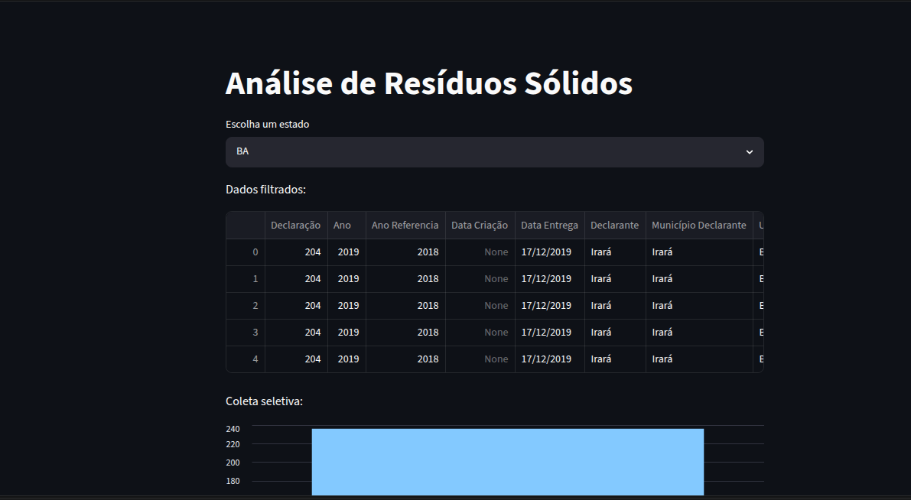

 # 📊 Análise de Resíduos Sólidos no Brasil

Este projeto tem como objetivo analisar dados públicos sobre a gestão de resíduos sólidos nos municípios brasileiros, utilizando Python e ferramentas de análise de dados.

---

## 🚀 Tecnologias Utilizadas

* Python
* Pandas
* Streamlit
* Matplotlib

---

## 📁 Estrutura do Projeto

```
📦 analise-residuos-python
 ┣ 📜 analise.py
 ┣ 📜 app.py
 ┣ 📜 Municipal-Diagnostico.csv
 ┣ 📜 requirements.txt
 ┗ 📸 dashboard.png
```

---

## 📊 Sobre a Análise

Foram analisados dados relacionados a:

* Coleta seletiva nos municípios
* Existência de plano de gestão de resíduos
* Quantidade de resíduos gerados (toneladas)
* Distribuição por estado

A análise permite identificar padrões e desigualdades na gestão de resíduos no Brasil.

---

## 📸 Dashboard



---

## 🧠 Principais Insights

* Nem todos os municípios possuem coleta seletiva implantada
* Há diferenças significativas entre estados
* A quantidade de resíduos varia bastante entre regiões
* Existem dados faltantes que podem impactar a análise

---

## ▶️ Como Executar o Projeto

### 1. Clonar o repositório

```
git clone https://github.com/flavisth/analise-residuos-python.git
```

### 2. Acessar a pasta

```
cd analise-residuos-python
```

### 3. Criar ambiente virtual

```
python3 -m venv venv
source venv/bin/activate
```

### 4. Instalar dependências

```
pip install -r requirements.txt
```

### 5. Rodar análise

```
python analise.py
```

### 6. Rodar dashboard

```
streamlit run app.py
```

---

## 🌐 Possível Expansão

* Deploy do dashboard na nuvem (Streamlit Cloud)
* Criação de filtros mais avançados
* Integração com outros datasets

---

## 👩‍💻 Autora

Projeto desenvolvido por **Flavia Tainara**
📧 [flathaynara4321@gmail.com](mailto:flathaynara4321@gmail.com)

---

## 💡 Objetivo

Este projeto foi desenvolvido como prática de análise de dados, com foco em preparação para estágio na área de tecnologia e dados.
